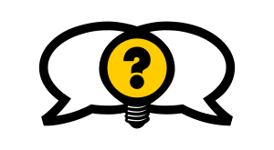

[comment]: # (Compile this presentation with the command below)
[comment]: # (mdslides docs.md --include dist)
[comment]: # (...or by running the Makefile with "make")

[comment]: # (THEME = streetepistemology)

[comment]: # (minScale: 0.2)
[comment]: # (maxScale: 4.0)
[comment]: # (controls: true)
[comment]: # (width: "80%")
[comment]: # (height: "80%")
[comment]: # (help: true)

### How to explore ideas & beliefs

1. [Set your goals](#/1)
2. [Build rapport](#/2)
3. [Find & confirm a claim](#/3)
4. [Clarify terms](#/4)
5. [Assess & calibrate confidence](#/5)
6. [Explore reasons & reliability](#/6)
7. [Summarize & pause to think](#/7)

\
*Swipe ↓ more; → next*

[comment]: # (||| data-background-size="50%" data-background-image="dist/media/street-epistemology-logo.png", data-background-position="100% 0%" data-background-opacity="0.2")

### What is Street Epistemology (SE)?

* A way to help us have better talks about hard topics.
* A conversational tool&shy;box for exploring ideas and beliefs.
* A step towards mas&shy;tering col&shy;laborative thinking.
* A community that prac&shy;tices SE in a frien&shy;dly environment.

[comment]: # (|||)

### What is Epistemology?

The field of Philosophy focusing on *how* we know what we know.

 

* *«How do we know if something is true?»*
* *«Which methods and tools can we employ to determine this?»*

\
With SE we try to bring this out of academia and into everyday life.

[comment]: # (!!!)

### 1. Set your goals

* Do you want to learn, teach or empathize?
* Are you also open to changing your own mind?
* Be honest about your intentions upfront.
* Maybe [share](#/8) this method too!

[comment]: # (||| data-background-size="50%" data-background-image="dist/media/street-epistemology-logo.png", data-background-position="100% 0%" data-background-opacity="0.2")

#### Your expectations

* Avoid *only* using these pages. There's more to learn!
* Unsure? Do *tech&shy;nique rebuttal* instead of *topic rebuttal.*
* *Explore how they know what they know.*

[comment]: # (|||)

#### Their expectations

* Avoid «scripted» conversations.
* Don't embarrass or make them feel cornered.
* Triumphing and «gotcha» moments are counter-<wbr>productive.

[comment]: # (!!!)

### 2. Build rapport

* Find a friendly tone & maintain it.
* Show that you are inter&shy;ested & listening.
* Share what You have in common.
* Show curiosity.
* Don't offer facts unless asked.

[comment]: # (||| data-background-size="50%" data-background-image="dist/media/street-epistemology-logo.png", data-background-position="100% 0%" data-background-opacity="0.2")

#### Patience & practice

*Keeping a frien&shy;dly tone is critical for success.*

 

* *Be patient* – It's fine to have seve&shy;ral chats before pro&shy;ce&shy;eding with the har&shy;dest topics.
* *Stay cool* – Avoiding *topic rebuttal* is hard, and often requires practice.
* *Learn more* – [Practice SE with strangers](#/8/1).

[comment]: # (!!!)

### 3. Find & confirm a claim

* Try to find or pick a single topic
* Ask if it's a good claim to explore
* Phrase the topic in the form of a claim

\
*It's OK to take time to consider claims!*

[comment]: # (||| data-background-size="50%" data-background-image="dist/media/street-epistemology-logo.png", data-background-position="100% 0%" data-background-opacity="0.2")

#### Good & bad claims

* ✅ Claim is positive, e.g. *«this exists / is true»*
* ✅ … Specific & clear.
* ✅ … Foundational or im&shy;portant
* ❌ … Trivial or obvious
* ⚠️  Stop if the claim is a *safety net*!

[comment]: # (|||)

#### Not all claims

*Safety net*, in this context, is something that pre&shy;vents an individual from doing harm to them&shy;selves or others.

\
*«My God helped me be&shy;come sober, and without Him I would probably drink myself to death.»*

\
Sometimes SE just isn't the right tool for the situation.

[comment]: # (!!!)

### 4. Clarify terms

**Repeat – Confirm – Qualify**

* *«What do you mean when you say this?»*
* In your own words, repeat what you hear.
* Ask if you understand correctly.
* Identify, clarify & qualify words that may confuse.

[comment]: # (||| data-background-size="50%" data-background-image="dist/media/street-epistemology-logo.png", data-background-position="100% 0%" data-background-opacity="0.2")

#### Politeness & clarity

Use *their* de&shy;fini&shy;tions when pos&shy;sible.

\
If it's dif&shy;ficult to *pin down* a term, use quali&shy;fied terms.

\
Adopting a *learner's per&shy;spec&shy;tive* may help.

[comment]: # (!!!)

### 5. Assess & calibrate confidence

* *«How confident are you this claim is true?»* 0–100%
* *«What would move you up just a bit?»*
* *«What would move you down?»*
* *«What could change your mind?»*

[comment]: # (||| data-background-size="50%" data-background-image="dist/media/street-epistemology-logo.png", data-background-position="100% 0%" data-background-opacity="0.2")

* At 100%, *«Would any&shy;thing increase your con&shy;fidence even higher?»*
* *«How would physical evidence change your con&shy;fidence?»*
* At 0%, *«What reasons do you think others have for being higher?»*
* Above 0%, *«Why not lower?»*
* Below 100%, *«Why not higher?»*

[comment]: # (|||)

* *«If this reason was un&shy;avail&shy;able to you, would it change your confidence?»*
* *«... and if not, what other rea&shy;son is keeping you at your level of confidence?»*

[comment]: # (!!!)

### 6. Explore reasons & reliability

**How – Reliability – Reconsider**

* What reasons did they use to arrive at their belief?
* Assess the quality of these reasons: *Outsider test*.
* What can we do to determine a reason is sound?
* If our methods are unreliable, would the assessment change?

[comment]: # (||| data-background-size="50%" data-background-image="dist/media/street-epistemology-logo.png", data-background-position="100% 0%" data-background-opacity="0.2")

*This is the key goal of Street&nbsp;Epistemology.*

 

* Explore the reliability of methods used when forming a belief.
* *How* questions are bet&shy;ter then *Why* and *What.*
* Embrace the pauses.
* *«Let's go through the steps together.»*
* *«How can we be con&shy;fident if our methods aren't reliable?»*

[comment]: # (|||)

#### Recognizing bad reasons

* ❌ [Informal fallacies](https://en.m.wikipedia.org/wiki/List_of_fallacies#Informal_fallacies), like *Appeals to au&shy;th&shy;ority*, *ig&shy;no&shy;rance* or *tradition.*
* ❌ [Cognitive biases](https://en.m.wikipedia.org/wiki/Cognitive_bias#List_of_biases), like *Con&shy;fir&shy;mation bias*, *Avail&shy;abi&shy;lity heu&shy;ris&shy;tic* and *Moti&shy;vated reasoning.*
* ❌ Sources don't pass [the C.R.A.A.P. test](https://en.m.wikipedia.org/wiki/CRAAP_test).

\
*«If a website only has thoughts I agree with, how can I know if it's truthful?»*

[comment]: # (!!!)

### 7. Summarize & pause to think

* Try to end with *aporia* and wonder.
* Success is when all are happy to have had the conversation.
* If you can, offer to con&shy;tinue the chat later.
* Offer them a printed [Introducing.SE card](dist/media/introducing-se-card-2021-01.pdf)!

\
[🔙 *to start*](#)

[comment]: # (||| data-background-size="50%" data-background-image="dist/media/street-epistemology-logo.png", data-background-position="100% 0%" data-background-opacity="0.2")

Some conversations may re&shy;quire several sessions.

\
End your sessions with some&shy;thing they can wonder about!

\
*«That was a good question. You're making me think!»*

[comment]: # (!!!)

###### Street&nbsp;Epistemology

###### Introducing.SE

[comment]: # (|||)

### About

<a property="dct:title" rel="cc:attributionURL" href="https://introducing.se">Introducing.SE</a> &amp; content, by <a rel="cc:attributionURL dct:creator" property="cc:attributionName" href="https://twitter.com/sjoshuan">Salve&nbsp;J.&nbsp;Nilsen</a> &amp; others, is licensed <a href="http://creativecommons.org/licenses/by-sa/4.0/?ref=chooser-v1" target="_blank" rel="license noopener noreferrer" style="display:inline-block;">CC-BY-SA-4.0 International </a>

#### Join the community

The Street&nbsp;Epistemology community is on [Discord](https://discord.gg/sKap3zM) and [elsewhere](https://streetepistemology.com/community).

#### Contribute

Source code and content is on [Github](https://github.com/sjn/introducing-se/).

[comment]: # (|||)
