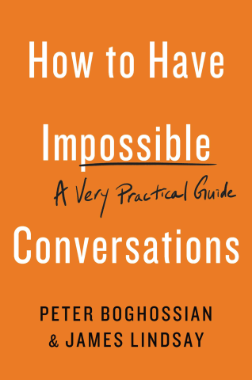
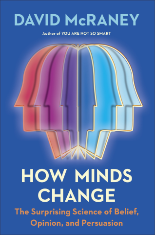

[comment]: # (Compile this presentation with the command below)
[comment]: # (mdslides docs.md --include dist)
[comment]: # (...or by running the Makefile with "make")

[comment]: # (THEME = streetepistemology)

[comment]: # (width: 960)
[comment]: # (height: 540)
[comment]: # (minScale: 0.2)
[comment]: # (maxScale: 4.0)
[comment]: # (controls: false)
[comment]: # (help: false)

## Street Epistemology

 

Salve J. Nilsen — Jared Elgvin

 

### oslohack:22

Note:
* Pre-workshop:
    * Bring multi-color post-it notes and pens
    * Set up 3 chairs per table, place pens & post-it notes on them
    * Bring Introducing.SE business cards
    * Wear your SE t-shirt!

[comment]: # (!!!)

### Street Epistemology

* What is SE?
* Agenda for this workshop

Note:
* A way, th&shy;rough civil con&shy;ver&shy;sa&shy;tion, to help one reflect on the qua&shy;lity of one's reasoning.
* Post-it notes & pen
    * Write one claim on front & your name on the glue side
    * Pick 1 topic keyword – a claim you care about
        * …wish more people knew about
        * …too many disagree with you
        * …shapes how you act every day
    * Interesting, engages you, needs attention, others discuss with you
* First: Video
* Second: Introducing SE
* Third: Gather post-it notes
* Fourth: Pick 2-3 post-it notes
* Fifth: Workshop!

[comment]: # (!!!)

<!-- Download https://www.youtube.com/watch?v=ZXnTA9irjo0 and place it in local/media/se-law-of-attraction.mp4 -->
<iframe width="880" height="480" src="../local/media/se-law-of-attraction.mp4" frameborder="0" allow="accelerometer; autoplay; clipboard-write; encrypted-media; gyroscope; picture-in-picture" allowfullscreen="true"></iframe>

Note:
* This is just one example
* Search for "Street Epistemology" on YouTube for more!

[comment]: # (!!! data-background-size="50%" data-background-image="dist/media/street-epistemology-logo.png", data-background-position="100% 0%" data-background-opacity="0.2")

### The Street Epistemology Checklist

1. [**Find a good tone** & get informed consent](#/4)
2. [**Pick a claim** & clarify](#/5)
3. [**Ask for confidence** on a scale & calibrate](#/6)
4. [**Identify main reason**](#/7)
5. [**Explore & assess** epi&shy;stemology & reliability](#/8)
6. [**End on aporia**, a question, a good tone](#/9)
7. [Consider & prepare](#/10)
8. [Learn more](#/11)

Note:
* What is SE: A way, th&shy;rough civil con&shy;ver&shy;sa&shy;tion, to help one reflect on the qua&shy;lity of one's reasoning.
* Epistemology: The field of Philosophy focusing on **how we know** what we know.
* Introducing.SE: A *prac&shy;tical in&shy;tro&shy;duc&shy;tion* and over&shy;view of Street Episte&shy;mology (SE

[comment]: # (!!! data-background-size="50%" data-background-image="dist/media/street-epistemology-logo.png", data-background-position="100% 0%" data-background-opacity="0.2")

### 1. Find a good tone & get informed consent

* Establish **friendly rap&shy;port**, and main&shy;tain&nbsp;it.
* **Tell them your intentions**, so they may consent.
* Avoid **topic rebuttal**.
* **Be tactful** in what you&nbsp;say.
* Be **mindful of their time**.

Note:
* Rapport: *Keeping a frien&shy;dly tone is critical for success*.
* Politeness: *Share, describe, be respectful, charitable*.
* Topic rebuttal: *Don't offer facts, but tech&shy;nique rebuttal*.
* Be tactful: ✅'s & ❌'s
* Recording: Ask for consent & manage time

[comment]: # (!!! data-background-size="50%" data-background-image="dist/media/street-epistemology-logo.png", data-background-position="100% 0%" data-background-opacity="0.2")

### 2. Pick a claim &&nbsp;clarify

* Find **a claim to explore**.
* What is **a good claim**?
* Turn **normative claims** factual.
* **Clarify** terms.
* Avoid **«Safety Net»** claims.

Note:
* Find a claim: Single, factual, claim
* Good claim: Specific, important, positive
* Normative caims: Ask "why" to make into factual claim
* Clarifying terms: "True for me", clarify, qualify, their definition, take notes
* «Safety Net»: Do no harm

[comment]: # (!!! data-background-size="50%" data-background-image="dist/media/street-epistemology-logo.png", data-background-position="100% 0%" data-background-opacity="0.2")

### 3. Ask for con&shy;fi&shy;dence on a scale &&nbsp;calibrate

* Ask for **confidence**.
* **Explore** their confidence.
* **Pre-contemplative** or&nbsp;not?
* **Nudging** confidence.

Note:
* Ask for confidence: polarization, scale, up, down, change
* Explore confidence: >100%, evidence, others, why not extremes
* Pre-contemplative: 0 or 100? trust? tribe?
* Nudging confidence: if room for more, calibrate? postpone, evidence, community

[comment]: # (!!! data-background-size="50%" data-background-image="dist/media/street-epistemology-logo.png", data-background-position="100% 0%" data-background-opacity="0.2")

### 4. Identify main reason

* What is **their most im&shy;portant source**, ex&shy;peri&shy;ence or reason?
* Are there any other **under&shy;lying reasons** sup&shy;porting this?
* **Many small reasons**, or a few large?

Note:
* Asking: what makes it good? better reason?
* Underlying: reason is unavailable, confidence change, yes: how? no: what else? switch topic?
* Many small/few large: commonalities, influence how, adds/multiplies, take notes

[comment]: # (!!! data-background-size="50%" data-background-image="dist/media/street-epistemology-logo.png", data-background-position="100% 0%" data-background-opacity="0.2")

### 5. Explore & assess epistemology & reliablility

*Is our epistemology reliable? Let's assess.*

 

* This is **the key goal of&nbsp;SE**.
* **Explore epistemology**.
* **Assess reliability**.
* **Recognize unreliable reasons**.

Note:
* The key goal: reliability, how > why > what
* Epistemology: arrive, rule out, soundness, reliability
* Reliability: Outsider, consultant, double standard
* Reliability: Conformity, status quo, selective skeptic
* Fallacies: Authority, ignorance, tradition
* Biases: confirmation, availability, motivated
* News: bias, misleading, fact check fails
* Publications: C.R.A.A.P test

[comment]: # (!!! data-background-size="50%" data-background-image="dist/media/street-epistemology-logo.png", data-background-position="100% 0%" data-background-opacity="0.2")

### 6. End on aporia, a question, a good tone

*The best endings offer food for thought!*

 

* Try **ending on aporia** or with a question.
* Offer them some **reasons to return**.

\
*«I've never thought about that!»*

Note:
* Ending: aporia, question, both happy, cont'd
* Returning: necessary? look forward, making one think

[comment]: # (!!! data-background-size="50%" data-background-image="dist/media/street-epistemology-logo.png", data-background-position="100% 0%" data-background-opacity="0.2")

### Consider & prepare

* Consider **your intentions**
* Adopt a **learner's attitude**
* Be aware of **their expectations**
* Do any necessary **prac&shy;tical preparations**

Note:
* Intentions: goal: learn or change mind? share!
* Learner's attitude: curiosity, open-minded, focus, connect ideas
* Expectation: ❌ scripted, interview, leading, messaging, embarrass, cornered
* Practical: note-taking, friend, recorder, timer, cards

[comment]: # (!!! data-background-size="50%" data-background-image="dist/media/street-epistemology-logo.png", data-background-position="100% 0%" data-background-opacity="0.2")

### Learn more

 

Note:
* *How Minds Change* by David McRaney
* *How to Have Impossible Conversations* by Peter Boghossian and James Lindsay
* *The Scout Mindset* by Julia Galef
* *Mental Immunity* by Andy Norman
* *A Manual for Creating Atheists* by Peter Boghossian

[comment]: # (!!! data-background-size="50%" data-background-image="dist/media/street-epistemology-logo.png", data-background-position="100% 0%" data-background-opacity="0.2")

### Introducing.SE

[comment]: # (!!!)

### Takk!

 

Jared Elgvin – Salve J. Nilsen

 

Next: **Workshop**

Note:
* Gather post-it notes
* Give SE business cards
* Stick them on the wall
* Let everyone pick 2-3 topics from the wall
* Have 1-on-1 chats
* Return discussed post-it note to wall
* Optionally exchange one of your notes with one on the wall
* Repeat

[comment]: # (|||)
